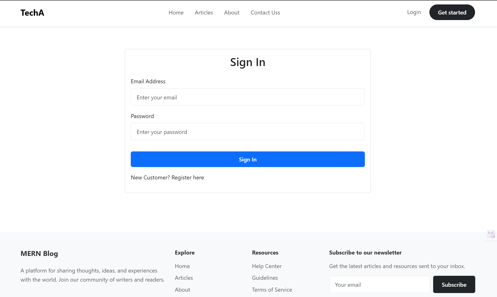

# Blog App

A full-stack MERN application for creating, managing, and sharing blog posts. The app includes user authentication (login and signup) and complete CRUD operations for blogs, with MongoDB as the database.

## Table of Contents
- [Features](#features)
- [Tech Stack](#tech-stack)
- [Project Structure](#project-structure)
- [Prerequisites](#prerequisites)
- [Installation](#installation)
- [Environment Variables](#environment-variables)
- [Running the App](#running-the-app)
- [API Endpoints](#api-endpoints)
- [Screenshots](#screenshots)
- [Contributing](#contributing)
- [License](#license)

## Features
- **User Authentication**:
  - Signup: Register a new user with email and password.
  - Login: Authenticate users and provide access to protected routes.
- **Blog CRUD Operations**:
  - Create: Write and publish new blog posts.
  - Read: View a list of blogs or a single blog post.
  - Update: Edit existing blog posts.
  - Delete: Remove blog posts.
- **MongoDB Integration**: Store user data and blog posts in a MongoDB database.
- **Responsive Design**: Frontend built with React, ensuring a seamless experience on both desktop and mobile devices.
- **RESTful API**: Backend built with Express.js and Node.js, providing a robust API for frontend communication.

## Tech Stack
- **Frontend**: React.js
- **Backend**: Node.js, Express.js
- **Database**: MongoDB (with Mongoose for ORM)
- **Authentication**: JWT (JSON Web Tokens) *(or specify if you used another method like bcrypt for password hashing)*
- **Styling**: CSS *(or specify if you used a library like Tailwind CSS, Bootstrap, etc.)*
- **Other Tools**: 
  - Git for version control
  - npm for package management

## Project Structure
```
blog-app/
├── backend/                    # Backend code (Node.js, Express.js)
│   ├── controllers/            # Request handlers for routes
│   ├── middleware/             # Custom middleware (e.g., authentication)
│   ├── models/                 # Mongoose models for MongoDB
│   ├── routes/                 # API routes
│   ├── .env                    # Environment variables (not tracked by Git)
│   └── server.js               # Entry point for the backend
├── frontend/                   # Frontend code (React)
│   ├── src/                    # React source files
│   │   ├── components/         # Reusable React components
│   │   ├── pages/              # Page components (e.g., Login, Signup, BlogList)
│   │   ├── context/            # Context for app
│   │   ├── utils/              # Utility functions 
│   │   ├── App.js              # Main React app component
│   │   └── index.js            # Entry point for React
│   ├── public/                 # Static assets (e.g., index.html)
│   └── package.json            # Frontend dependencies
├── .gitignore                  # Files and folders to ignore in Git
├── package.json                # Root-level dependencies (if applicable)
└── README.md                   # Project documentation
```

## Prerequisites
Before you begin, ensure you have the following installed:
- [Node.js](https://nodejs.org/) (v14.x or later)
- [npm](https://www.npmjs.com/) (comes with Node.js)
- [MongoDB](https://www.mongodb.com/) (either locally or use a cloud service like MongoDB Atlas)
- [Git](https://git-scm.com/) (for cloning the repository)

## Installation
Follow these steps to set up the project locally:

1. **Clone the Repository**  
   ```
   git clone https://github.com/Anishkr0/Blog_App
   cd Blog_App
   ```

2. **Install Backend Dependencies**  
   Navigate to the `backend` directory and install the required packages:
   ```
   cd backend
   npm install
   ```

3. **Install Frontend Dependencies**  
   Navigate to the `frontend-ui` directory and install the required packages:
   ```
   cd ../frontend-ui
   npm install
   ```

4. **Set Up MongoDB**  
   - If using a local MongoDB instance, ensure MongoDB is running:
     ```
     mongod
     ```
   - If using MongoDB Atlas, get your connection string from the Atlas dashboard.

## Environment Variables
Create a `.env` file in the `backend` directory and add the following environment variables:

```
# Backend environment variables
PORT=5000                        # Port for the backend server
MONGO_URI=your-mongodb-uri       # MongoDB connection string (e.g., mongodb://localhost/blog-app or MongoDB Atlas URI)
JWT_SECRET=your-jwt-secret       # Secret key for JWT (replace with a secure value)
```

*(Optional: If your frontend needs environment variables, create a `.env` file in the `frontend` directory as well, e.g., for API base URL.)*

## Running the App
1. **Start the Backend Server**  
   From the `backend` directory, run:
   ```
   npm start
   ```
   The backend server will run on `http://localhost:5000` (or the port specified in your `.env` file).

2. **Start the Frontend**  
   From the `frontend-ui` directory, run:
   ```
   npm start
   ```
   The React app will run on `http://localhost:3000` by default and open in your browser.

3. **Access the App**  
   Open your browser and navigate to `http://localhost:3000` to use the Blog App.

## API Endpoints
The backend provides the following RESTful API endpoints:

### Authentication
- `POST /api/auth/signup` - Register a new user  
  *Request Body*: `{ "email": "user@example.com", "password": "password123" }`
- `POST /api/auth/login` - Log in a user and return a JWT token  
  *Request Body*: `{ "email": "user@example.com", "password": "password123" }`

### Blogs
- `GET /api/blogs` - Get a list of all blog posts
- `GET /api/blogs/:id` - Get a single blog post by ID
- `POST /api/blogs` - Create a new blog post (requires authentication)  
  *Request Body*: `{ "title": "My Blog", "content": "This is my blog post..." }`
- `PUT /api/blogs/:id` - Update a blog post by ID (requires authentication)  
  *Request Body*: `{ "title": "Updated Title", "content": "Updated content..." }`
- `DELETE /api/blogs/:id` - Delete a blog post by ID (requires authentication)

*(Note: Adjust the endpoint paths and details based on your actual implementation.)*

## Screenshots
*(Optional: Add screenshots of your app to showcase its features.)*

- **Home Page**  
  

- **Blog Post**  
  

- **Login Page**  
  

## Contributing
Contributions are welcome! To contribute:
1. Fork the repository.
2. Create a new branch (`git checkout -b feature/your-feature`).
3. Make your changes and commit (`git commit -m "Add your feature"`).
4. Push to your branch (`git push origin feature/your-feature`).
5. Open a Pull Request.

## License
This project is licensed under the MIT License. See the [LICENSE](LICENSE) file for details.

---
